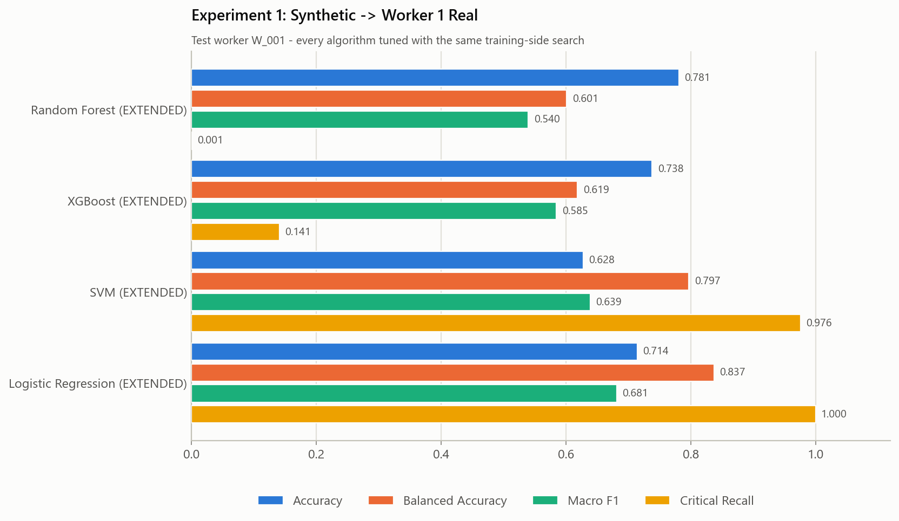
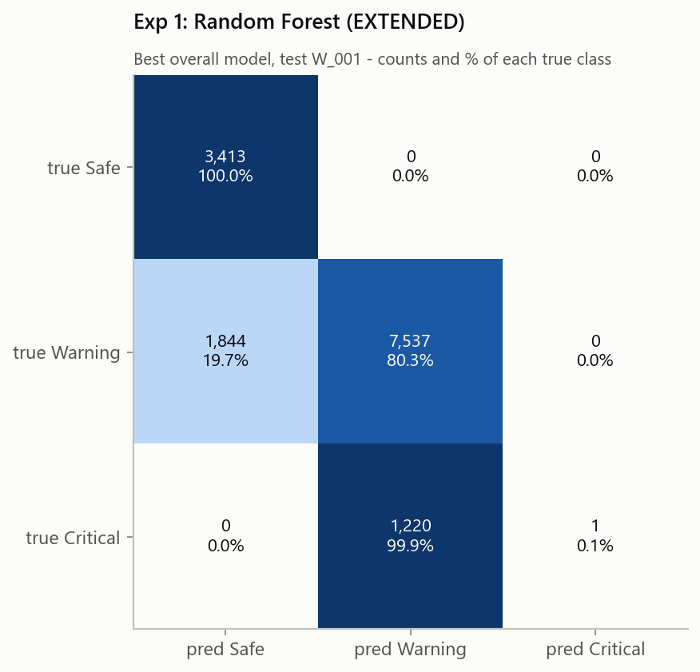
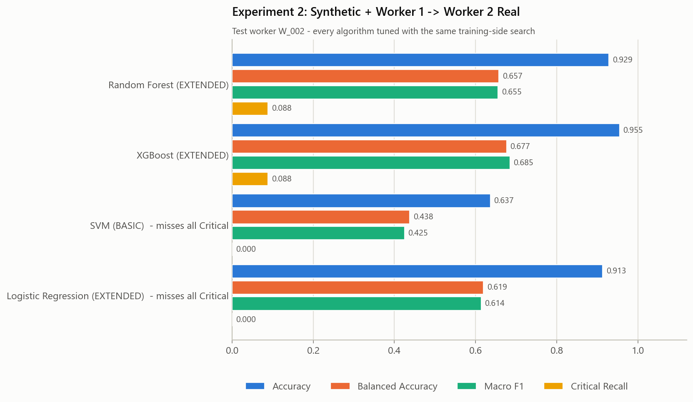
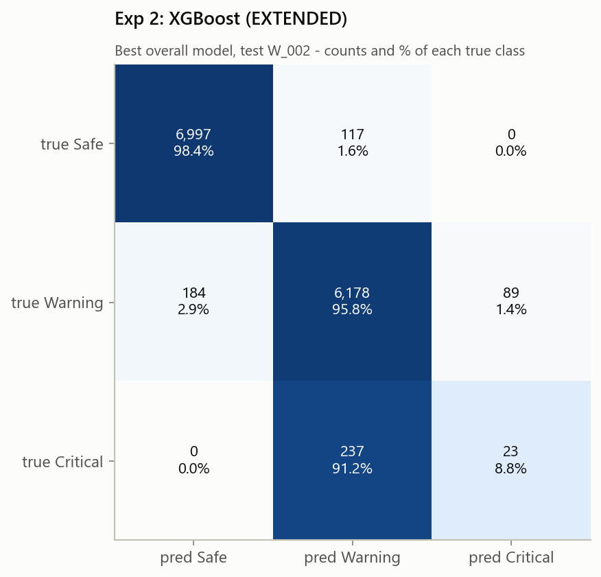
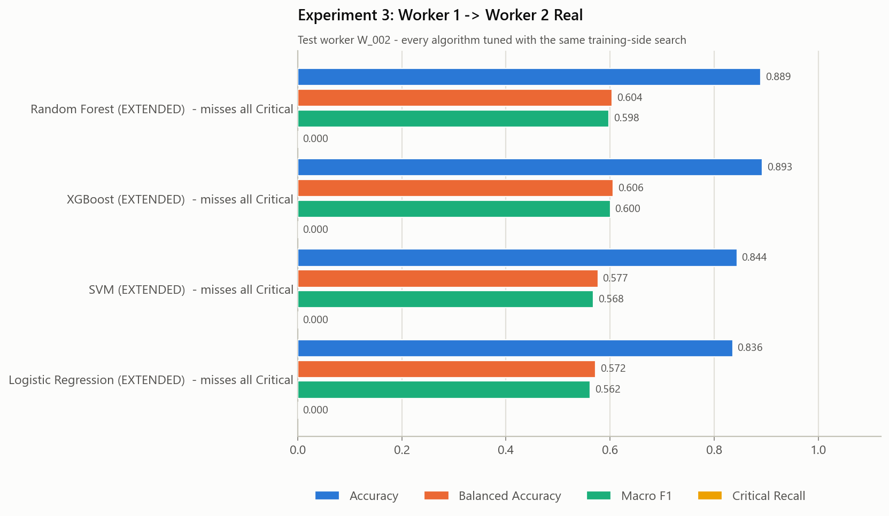
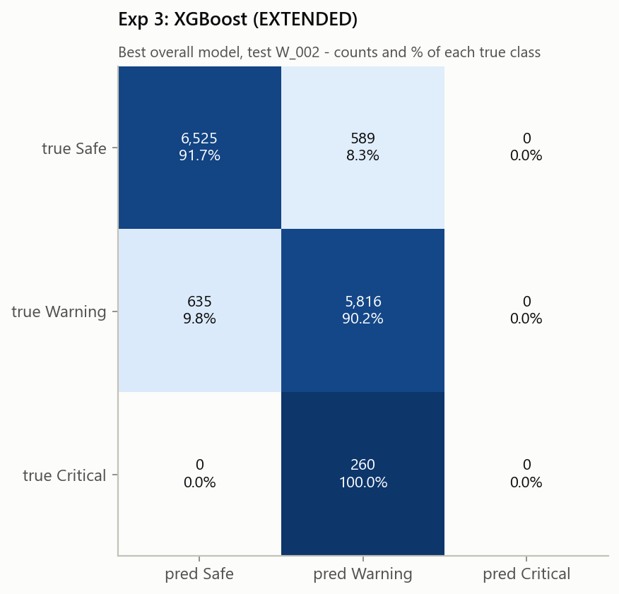
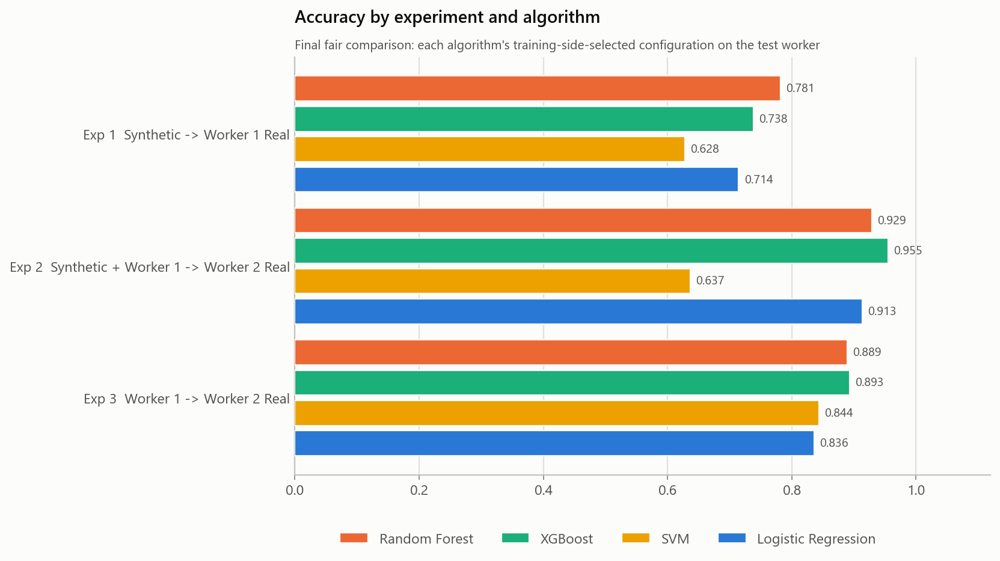
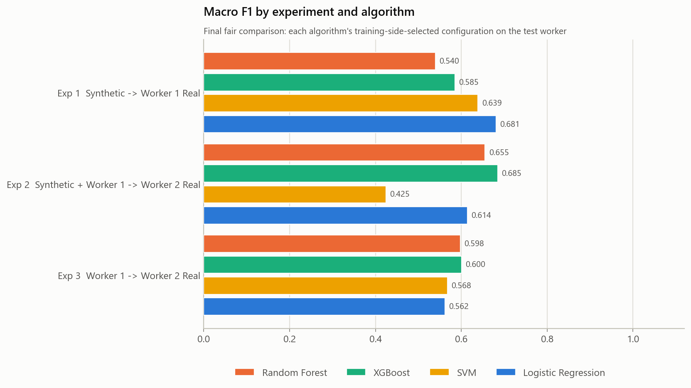
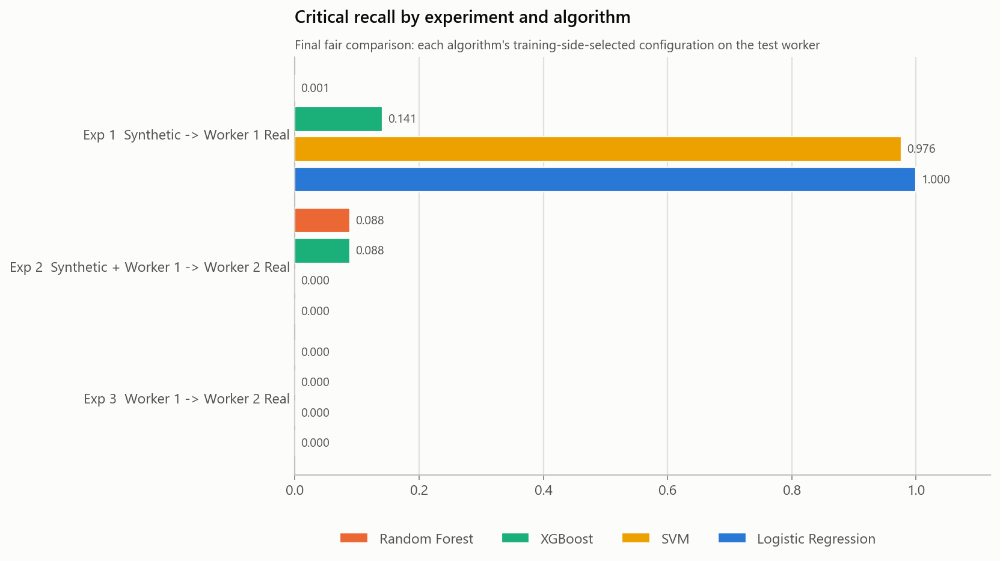

# ProSafe ML V2 - final fair model comparison (three experiments)

Generated by `python src/run_experiments.py`.

## Fairness of this comparison

Earlier, XGBoost had been optimized more deeply than the other algorithms (a separate XGBoost-only study). This final experiment corrects that imbalance by giving **Random Forest, XGBoost, SVM and Logistic Regression comparable training-only hyperparameter and feature-set optimization**: the same budget of 12 seeded configurations x 3 feature sets = 36 candidates per algorithm per experiment, the same folds, and the same selection rule. **This result replaces the earlier, unfair model comparison for algorithm-selection purposes.**

## How to read these numbers

The previous ProSafe model reported about **98.9 % XGBoost accuracy** on a random row-level 80/20 split, where highly related neighbouring seconds of the same workers were divided randomly between training and testing. Here every model is tested on a **different dataset / worker** than it was trained on (cross-dataset, cross-worker transfer). That is a harder generalization problem, so the two kinds of score are not comparable; the old split was not reproduced.

Accuracy is shown first, but a model is flagged when it fails on Critical: **UNSAFE** (Critical recall = 0), **POOR** (< 0.25), **LIMITED** (0.25-0.50).

## Method

| Experiment | Train | Test | Training-side validation |
|---|---|---|---|
| 1 Synthetic -> Worker 1 Real | prosafe_synthetic_ml_ready.csv | prosafe_W001_ml_ready.csv | LeaveOneGroupOut by worker_id (4 folds: S_001, S_002, S_003, S_004) |
| 2 Synthetic + Worker 1 -> Worker 2 Real | prosafe_synthetic_ml_ready.csv + prosafe_W001_ml_ready.csv | prosafe_W002_ml_ready.csv | LeaveOneGroupOut by worker_id (5 folds: S_001, S_002, S_003, S_004, W_001) |
| 3 Worker 1 -> Worker 2 Real | prosafe_W001_ml_ready.csv | prosafe_W002_ml_ready.csv | 5 contiguous chronological blocks of W_001, 300 rows purged on both sides of each validation block |

* **Search space** (sampled reproducibly, seed 42, the same 12 configurations tried with every feature set): Random Forest - n_estimators, max_depth, min_samples_split/leaf, max_features, criterion, class_weight (balanced / balanced_subsample / None), bootstrap; XGBoost - n_estimators (cap, early-stopped), learning_rate, max_depth, min_child_weight, subsample, colsample_bytree, gamma, reg_alpha, reg_lambda, training-only sample weights (unweighted, or balanced x Critical {1, 1.25, 1.5, 2, 3} x Warning {0.75, 1, 1.25}); SVM - 8 RBF (C 0.01-100, gamma scale/auto/0.0001-1), 2 linear (C 0.001-100), 2 polynomial (degree 2-3), class_weight balanced / None, probability=False during tuning; Logistic Regression - 6 L2 (lbfgs / newton-cg / saga), 3 L1 (liblinear / saga), 3 elastic-net (saga, l1_ratio 0.25-0.75), C 0.001-100, class_weight balanced / None, max_iter 5000; non-converged configurations are discarded, not used.
* Imputation (median) and StandardScaler for SVM / Logistic Regression, class weights and XGBoost early stopping (interleaved 300-row blocks inside the training fold, never the validation or test rows) are all fitted on the training fold only.
* **Selection rule:** candidates within 0.01 of the best cross-validated accuracy, then highest macro F1 -> balanced accuracy -> Critical recall -> lowest Critical->Safe rate. The selected configuration is refitted on the whole training data and evaluated once on the test worker.
* Validation folds without Critical (S_002 in Experiments 1-2; time blocks 1-2 of W_001 in Experiment 3) are kept as they are: metrics are computed on the pooled out-of-fold predictions, which contain all three classes.

## Experiment 1: Synthetic -> Worker 1 Real

| model | feature set | accuracy | bal. acc. | macro P | macro R | macro F1 | weighted F1 | Crit P | Crit R | Crit F1 | Crit->Warning | Crit->Safe | CV acc. | CV macro F1 |
|---|---|---|---|---|---|---|---|---|---|---|---|---|---|---|
| Random Forest | EXTENDED | 0.7814 | 0.6014 | 0.8366 | 0.6014 | 0.5400 | 0.7482 | 1.0000 | 0.0008 | 0.0016 | 1220 (99.9 %) | 0 (0.0 %) | 0.9438 | 0.8258 |
| XGBoost | EXTENDED | 0.7382 | 0.6187 | 0.8098 | 0.6187 | 0.5851 | 0.7241 | 1.0000 | 0.1409 | 0.2469 | 1049 (85.9 %) | 0 (0.0 %) | 0.9221 | 0.7772 |
| SVM | EXTENDED | 0.6279 | 0.7972 | 0.7159 | 0.7972 | 0.6389 | 0.6846 | 0.1914 | 0.9762 | 0.3200 | 29 (2.4 %) | 0 (0.0 %) | 0.8837 | 0.7748 |
| Logistic Regression | EXTENDED | 0.7144 | 0.8372 | 0.6778 | 0.8372 | 0.6814 | 0.7409 | 0.3007 | 1.0000 | 0.4623 | 0 (0.0 %) | 0 (0.0 %) | 0.8728 | 0.7502 |

**Best overall model:** Random Forest (EXTENDED).

* Random Forest: POOR CRITICAL DETECTION (Critical recall 0.001)
* XGBoost: POOR CRITICAL DETECTION (Critical recall 0.141)

Selected configurations (training side):

* **Random Forest** - EXTENDED; n_estimators=200, min_samples_split=12, min_samples_leaf=6, max_features=0.75, max_depth=32, criterion=entropy, class_weight=balanced, bootstrap=False; 36 candidates; 21.5 min.
* **XGBoost** - EXTENDED; subsample=1.0, reg_lambda=2, reg_alpha=1.0, n_estimators=16, min_child_weight=10, max_depth=5, learning_rate=0.05, gamma=0.5, colsample_bytree=0.9, class_weight=balanced, critical_weight=2.0, warning_weight=1.25; 36 candidates; 4.0 min.
* **SVM** - EXTENDED; kernel=linear, C=10, class_weight=balanced; 36 candidates; 6.6 min.
* **Logistic Regression** - EXTENDED; penalty=l1, solver=saga, C=0.3, class_weight=None, max_iter=5000; 36 candidates (10 non-converged discarded); 14.7 min.

Per-class (precision / recall / F1):

| model | Safe | Warning | Critical |
|---|---|---|---|
| Random Forest | 0.649 / 1.000 / 0.787 | 0.861 / 0.803 / 0.831 | 1.000 / 0.001 / 0.002 |
| XGBoost | 0.566 / 0.992 / 0.721 | 0.863 / 0.724 / 0.787 | 1.000 / 0.141 / 0.247 |
| SVM | 0.986 / 0.950 / 0.968 | 0.971 / 0.465 / 0.629 | 0.191 / 0.976 / 0.320 |
| Logistic Regression | 0.788 / 0.903 / 0.841 | 0.945 / 0.609 / 0.741 | 0.301 / 1.000 / 0.462 |

## Experiment 2: Synthetic + Worker 1 -> Worker 2 Real (primary hybrid experiment)

| model | feature set | accuracy | bal. acc. | macro P | macro R | macro F1 | weighted F1 | Crit P | Crit R | Crit F1 | Crit->Warning | Crit->Safe | CV acc. | CV macro F1 |
|---|---|---|---|---|---|---|---|---|---|---|---|---|---|---|
| Random Forest | EXTENDED | 0.9285 | 0.6574 | 0.6562 | 0.6574 | 0.6553 | 0.9310 | 0.0630 | 0.0885 | 0.0736 | 237 (91.2 %) | 0 (0.0 %) | 0.8869 | 0.6431 |
| XGBoost | EXTENDED | 0.9546 | 0.6766 | 0.7085 | 0.6766 | 0.6848 | 0.9501 | 0.2054 | 0.0885 | 0.1237 | 237 (91.2 %) | 0 (0.0 %) | 0.8256 | 0.6879 |
| SVM | BASIC | 0.6365 | 0.4377 | 0.4425 | 0.4377 | 0.4248 | 0.6233 | 0.0000 | 0.0000 | 0.0000 | 259 (99.6 %) | 1 (0.4 %) | 0.8246 | 0.6569 |
| Logistic Regression | EXTENDED | 0.9132 | 0.6193 | 0.6091 | 0.6193 | 0.6139 | 0.9042 | 0.0000 | 0.0000 | 0.0000 | 260 (100.0 %) | 0 (0.0 %) | 0.8183 | 0.7353 |

**Best overall model:** XGBoost (EXTENDED).

* Random Forest: POOR CRITICAL DETECTION (Critical recall 0.088)
* XGBoost: POOR CRITICAL DETECTION (Critical recall 0.088)
* SVM: UNSAFE CRITICAL DETECTION: model missed every Critical test observation.
* Logistic Regression: UNSAFE CRITICAL DETECTION: model missed every Critical test observation.

Selected configurations (training side):

* **Random Forest** - EXTENDED; n_estimators=300, min_samples_split=8, min_samples_leaf=1, max_features=1.0, max_depth=16, criterion=log_loss, class_weight=balanced_subsample, bootstrap=False; 36 candidates; 64.2 min.
* **XGBoost** - EXTENDED; subsample=1.0, reg_lambda=5, reg_alpha=0.1, n_estimators=20, min_child_weight=1, max_depth=8, learning_rate=0.15, gamma=0.05, colsample_bytree=0.6, class_weight=balanced, critical_weight=1.0, warning_weight=0.75; 36 candidates; 3.7 min.
* **SVM** - BASIC_PERSONALIZED; kernel=rbf, C=10, gamma=0.0001, class_weight=None; 36 candidates; 24.3 min.
* **Logistic Regression** - EXTENDED; penalty=l1, solver=saga, C=0.1, class_weight=None, max_iter=5000; 36 candidates; 8.5 min.

Per-class (precision / recall / F1):

| model | Safe | Warning | Critical |
|---|---|---|---|
| Random Forest | 0.946 / 0.999 / 0.972 | 0.959 / 0.885 / 0.920 | 0.063 / 0.088 / 0.074 |
| XGBoost | 0.974 / 0.984 / 0.979 | 0.946 / 0.958 / 0.952 | 0.205 / 0.088 / 0.124 |
| SVM | 0.749 / 0.497 / 0.597 | 0.578 / 0.816 / 0.677 | 0.000 / 0.000 / 0.000 |
| Logistic Regression | 0.909 / 0.964 / 0.936 | 0.918 / 0.894 / 0.906 | 0.000 / 0.000 / 0.000 |

## Experiment 3: Worker 1 -> Worker 2 Real

| model | feature set | accuracy | bal. acc. | macro P | macro R | macro F1 | weighted F1 | Crit P | Crit R | Crit F1 | Crit->Warning | Crit->Safe | CV acc. | CV macro F1 |
|---|---|---|---|---|---|---|---|---|---|---|---|---|---|---|
| Random Forest | EXTENDED | 0.8895 | 0.6038 | 0.5925 | 0.6038 | 0.5981 | 0.8810 | 0.0000 | 0.0000 | 0.0000 | 260 (100.0 %) | 0 (0.0 %) | 0.8360 | 0.6913 |
| XGBoost | EXTENDED | 0.8927 | 0.6063 | 0.5946 | 0.6063 | 0.6004 | 0.8843 | 0.0000 | 0.0000 | 0.0000 | 260 (100.0 %) | 0 (0.0 %) | 0.8163 | 0.7114 |
| SVM | EXTENDED | 0.8439 | 0.5770 | 0.5772 | 0.5770 | 0.5679 | 0.8358 | 0.0000 | 0.0000 | 0.0000 | 260 (100.0 %) | 0 (0.0 %) | 0.8736 | 0.8090 |
| Logistic Regression | EXTENDED | 0.8357 | 0.5719 | 0.5753 | 0.5719 | 0.5621 | 0.8271 | 0.0000 | 0.0000 | 0.0000 | 260 (100.0 %) | 0 (0.0 %) | 0.8456 | 0.7418 |

**Best overall model:** XGBoost (EXTENDED).

* Random Forest: UNSAFE CRITICAL DETECTION: model missed every Critical test observation.
* XGBoost: UNSAFE CRITICAL DETECTION: model missed every Critical test observation.
* SVM: UNSAFE CRITICAL DETECTION: model missed every Critical test observation.
* Logistic Regression: UNSAFE CRITICAL DETECTION: model missed every Critical test observation.

Selected configurations (training side):

* **Random Forest** - EXTENDED; n_estimators=1000, min_samples_split=12, min_samples_leaf=4, max_features=0.5, max_depth=32, criterion=gini, class_weight=balanced, bootstrap=False; 36 candidates; 10.0 min.
* **XGBoost** - EXTENDED; subsample=0.6, reg_lambda=2, reg_alpha=1.0, n_estimators=283, min_child_weight=5, max_depth=6, learning_rate=0.05, gamma=1.0, colsample_bytree=0.6, class_weight=balanced, critical_weight=1.5, warning_weight=0.75; 36 candidates; 1.7 min.
* **SVM** - EXTENDED; kernel=rbf, C=10, gamma=0.0001, class_weight=None; 36 candidates; 2.0 min.
* **Logistic Regression** - EXTENDED; penalty=l2, solver=lbfgs, C=0.01, class_weight=None, max_iter=5000; 36 candidates; 4.0 min.

Per-class (precision / recall / F1):

| model | Safe | Warning | Critical |
|---|---|---|---|
| Random Forest | 0.902 / 0.923 / 0.912 | 0.876 / 0.889 / 0.882 | 0.000 / 0.000 / 0.000 |
| XGBoost | 0.911 / 0.917 / 0.914 | 0.873 / 0.902 / 0.887 | 0.000 / 0.000 / 0.000 |
| SVM | 0.973 / 0.754 / 0.850 | 0.759 / 0.977 / 0.854 | 0.000 / 0.000 / 0.000 |
| Logistic Regression | 0.980 / 0.732 / 0.838 | 0.745 / 0.984 / 0.848 | 0.000 / 0.000 / 0.000 |

## Final three-experiment comparison (every algorithm)

| experiment | model | feature set | accuracy | bal. acc. | macro F1 | Crit R | Crit F1 | flag |
|---|---|---|---|---|---|---|---|---|
| 1 | Random Forest | EXTENDED | 0.7814 | 0.6014 | 0.5400 | 0.0008 | 0.0016 | POOR CRITICAL DETECTION (Critical recall 0.001) |
| 1 | XGBoost | EXTENDED | 0.7382 | 0.6187 | 0.5851 | 0.1409 | 0.2469 | POOR CRITICAL DETECTION (Critical recall 0.141) |
| 1 | SVM | EXTENDED | 0.6279 | 0.7972 | 0.6389 | 0.9762 | 0.3200 | ok |
| 1 | Logistic Regression | EXTENDED | 0.7144 | 0.8372 | 0.6814 | 1.0000 | 0.4623 | ok |
| 2 | Random Forest | EXTENDED | 0.9285 | 0.6574 | 0.6553 | 0.0885 | 0.0736 | POOR CRITICAL DETECTION (Critical recall 0.088) |
| 2 | XGBoost | EXTENDED | 0.9546 | 0.6766 | 0.6848 | 0.0885 | 0.1237 | POOR CRITICAL DETECTION (Critical recall 0.088) |
| 2 | SVM | BASIC | 0.6365 | 0.4377 | 0.4248 | 0.0000 | 0.0000 | UNSAFE CRITICAL DETECTION: model missed every Critical test observation. |
| 2 | Logistic Regression | EXTENDED | 0.9132 | 0.6193 | 0.6139 | 0.0000 | 0.0000 | UNSAFE CRITICAL DETECTION: model missed every Critical test observation. |
| 3 | Random Forest | EXTENDED | 0.8895 | 0.6038 | 0.5981 | 0.0000 | 0.0000 | UNSAFE CRITICAL DETECTION: model missed every Critical test observation. |
| 3 | XGBoost | EXTENDED | 0.8927 | 0.6063 | 0.6004 | 0.0000 | 0.0000 | UNSAFE CRITICAL DETECTION: model missed every Critical test observation. |
| 3 | SVM | EXTENDED | 0.8439 | 0.5770 | 0.5679 | 0.0000 | 0.0000 | UNSAFE CRITICAL DETECTION: model missed every Critical test observation. |
| 3 | Logistic Regression | EXTENDED | 0.8357 | 0.5719 | 0.5621 | 0.0000 | 0.0000 | UNSAFE CRITICAL DETECTION: model missed every Critical test observation. |

  

## Did synthetic augmentation help? Experiment 2 (synthetic + W_001 -> W_002) minus Experiment 3 (W_001 -> W_002)

| model | delta accuracy | delta bal. acc. | delta macro F1 | delta Critical recall |
|---|---|---|---|---|
| Random Forest | +0.0391 | +0.0536 | +0.0572 | +0.0885 |
| XGBoost | +0.0620 | +0.0703 | +0.0844 | +0.0885 |
| SVM | -0.2074 | -0.1393 | -0.1431 | +0.0000 |
| Logistic Regression | +0.0775 | +0.0474 | +0.0518 | +0.0000 |

## Feature sets (training side only)

Best cross-validated candidate within each feature set (same selection rule). Test metrics are reported only for the configuration finally selected per algorithm. Full rows: `feature_set_comparison.csv`.

CV accuracy:

|                                 |   BASIC_PERSONALIZED |   EXTENDED |   TEMPORAL_PERSONALIZED |
|:--------------------------------|---------------------:|-----------:|------------------------:|
| ('EXP1', 'Logistic Regression') |               0.8151 |     0.8728 |                  0.8425 |
| ('EXP1', 'Random Forest')       |               0.8471 |     0.9438 |                  0.8607 |
| ('EXP1', 'SVM')                 |               0.849  |     0.8837 |                  0.8364 |
| ('EXP1', 'XGBoost')             |               0.8546 |     0.9221 |                  0.8333 |
| ('EXP2', 'Logistic Regression') |               0.8151 |     0.8183 |                  0.8104 |
| ('EXP2', 'Random Forest')       |               0.7848 |     0.8869 |                  0.821  |
| ('EXP2', 'SVM')                 |               0.8246 |     0.8342 |                  0.7963 |
| ('EXP2', 'XGBoost')             |               0.7776 |     0.8256 |                  0.7507 |
| ('EXP3', 'Logistic Regression') |               0.7922 |     0.8456 |                  0.833  |
| ('EXP3', 'Random Forest')       |               0.7189 |     0.836  |                  0.7893 |
| ('EXP3', 'SVM')                 |               0.7818 |     0.8736 |                  0.8287 |
| ('EXP3', 'XGBoost')             |               0.7091 |     0.8163 |                  0.7775 |

CV macro F1:

|                                 |   BASIC_PERSONALIZED |   EXTENDED |   TEMPORAL_PERSONALIZED |
|:--------------------------------|---------------------:|-----------:|------------------------:|
| ('EXP1', 'Logistic Regression') |               0.7135 |     0.7502 |                  0.7436 |
| ('EXP1', 'Random Forest')       |               0.7872 |     0.8258 |                  0.7507 |
| ('EXP1', 'SVM')                 |               0.7662 |     0.7748 |                  0.8017 |
| ('EXP1', 'XGBoost')             |               0.7447 |     0.7772 |                  0.6874 |
| ('EXP2', 'Logistic Regression') |               0.6531 |     0.7353 |                  0.6283 |
| ('EXP2', 'Random Forest')       |               0.6464 |     0.6431 |                  0.627  |
| ('EXP2', 'SVM')                 |               0.6569 |     0.5606 |                  0.6205 |
| ('EXP2', 'XGBoost')             |               0.6431 |     0.6879 |                  0.5668 |
| ('EXP3', 'Logistic Regression') |               0.696  |     0.7418 |                  0.7671 |
| ('EXP3', 'Random Forest')       |               0.6123 |     0.6913 |                  0.6661 |
| ('EXP3', 'SVM')                 |               0.5357 |     0.809  |                  0.7581 |
| ('EXP3', 'XGBoost')             |               0.6211 |     0.7114 |                  0.6452 |

## Notes

* W_001 and W_002 were already evaluated in earlier work. Selection here used only the training side, but any redesign motivated by these results needs a NEW unseen real worker for an unbiased estimate.
* Why Critical is missed on W_002 (UV-driven Critical absent from training): `critical_failure_analysis.md`.
* Models: `models/experiments/exp{1,2,3}_{random_forest,xgboost,svm,logistic_regression}.pkl`. `models/best_model.pkl` (previous candidate) was not changed.
* Total runtime: 165.5 min.
